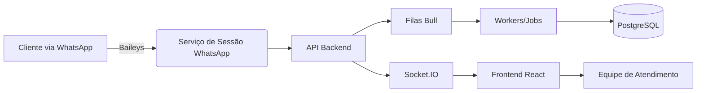

## Arquitetura de alto nível

### Camadas

1. **Interface (Frontend)**
   - React 17, Material UI, CRACO.
   - Consome REST (`/api`) e Socket.IO (`/socket.io/`), com autenticação JWT.
   - Build distribuído via nginx em produção (ver `frontend/Dockerfile`).

2. **Aplicação (Backend)**
   - Node.js 22, TypeScript, Express.
   - Sequelize + PostgreSQL como fonte primária de dados.
   - Bull/Redis para filas de envio de mensagens, sincronização de contatos e processamento pesado.
   - Serviços auxiliares: Baileys (WhatsApp), Puppeteer, ffmpeg, conversão de mídia, reconhecimento OCR, integrações com Gateways de pagamento.

3. **Infraestrutura compartilhada**
   - PostgreSQL 15 (Docker ou serviço gerenciado).
   - Redis 6.2 para cache, filas e adaptação Socket.IO.
   - Armazenamento de mídias em volumes Docker (`backend-private`, `backend-public`) ou buckets externos.

### Fluxo principal de mensagens

### Integrações essenciais

- **Baileys**: gerencia sessões WhatsApp, eventos de mensagens e QRCode.
- **Socket.IO**: comunicação em tempo real com front (namespaces `workspace-<companyId>`).
- **Redis**: adapter Socket.IO, filas Bull e cache de sessões.
- **ffmpeg**: transcodificação de mídia (áudio, vídeo, imagens).
- **Google Generative AI / OpenAI**: assistentes inteligentes (ver `backend/src/services` para implementações específicas).

### Segurança

- JWTs com segredos configuráveis (`JWT_SECRET`, `JWT_REFRESH_SECRET`).
- TLS opcional para banco (`DB_SSL`, `DB_SSL_REJECT_UNAUTHORIZED`).
- Rate limiting em Redis (`REDIS_OPT_LIMITER_MAX`, `REDIS_OPT_LIMITER_DURATION`).

### Observabilidade

- Logs estruturados via `pino` e `winston`.
- Scripts de diagnóstico em `backend/src/utils/`.
- Recomenda-se integrar com Sentry (já previsto em dependências) e utilizar métricas do Redis/PostgreSQL.

